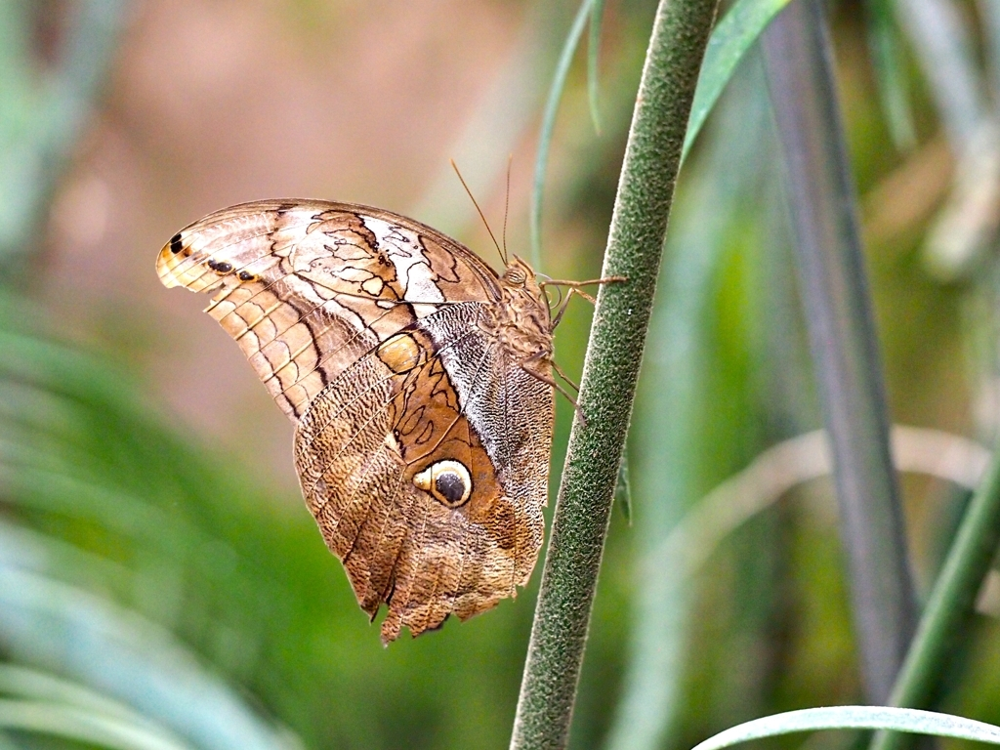
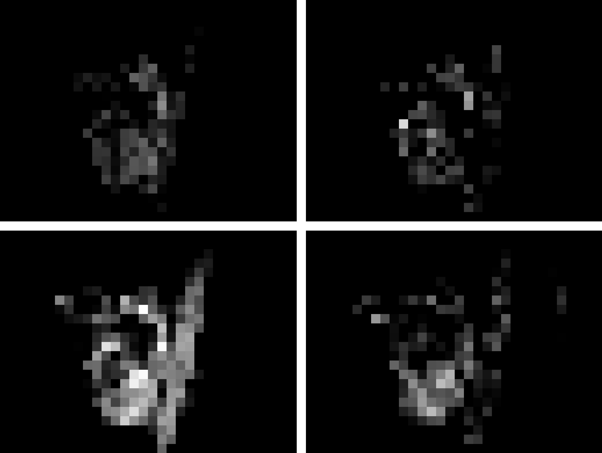
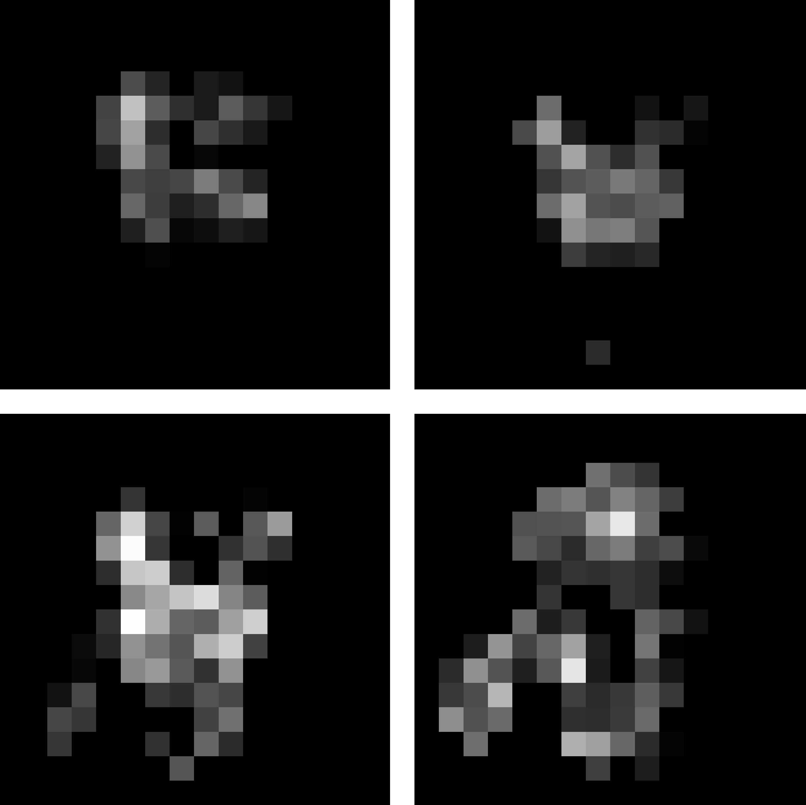

# BLIND NATURAL IMAGE QUALITY PREDICTION USING CONVOLUTIONAL NEURAL NETWORKS AND WEIGHTED SPATIAL POOLING
By Yicheng Su(suyicheng1995@gmail.com) and Jari Korhonen

## Introduction
This repository is the [PyTorch](http://pytorch.org) implementation of "[BLIND NATURAL IMAGE QUALITY PREDICTION USING CONVOLUTIONAL NEURAL NETWORKS AND WEIGHTED SPATIAL POOLING](#)" in ICIP2020.

<p align = 'center'>

</p>
<p align = 'center'>
Illustration of the proposed weighted spatial pooling scheme
</p>


There are example images and corresponding weight maps for channels 500, 1000, 1500 and 2000.
(a) An example image from KonIQ-10k, and (b) respective weight maps.
(c) An example image from Live-itW, and (d)respective weight maps.


<p align = 'center'>




</p>


### Citation
```
@inproceedings{su2020WSP,
  title={BLIND NATURAL IMAGE QUALITY PREDICTION USING CONVOLUTIONAL NEURAL NETWORKS AND WEIGHTED SPATIAL POOLING},
  author={Su, Yicheng and Korhonen, Jari},
  booktitle={2020 IEEE International Conference on Image Processing (ICIP)},
  year={2020},
  organization={IEEE}
}
```

## Requirements
## Training
## Evaluation
## Pre-trained Models
## Results